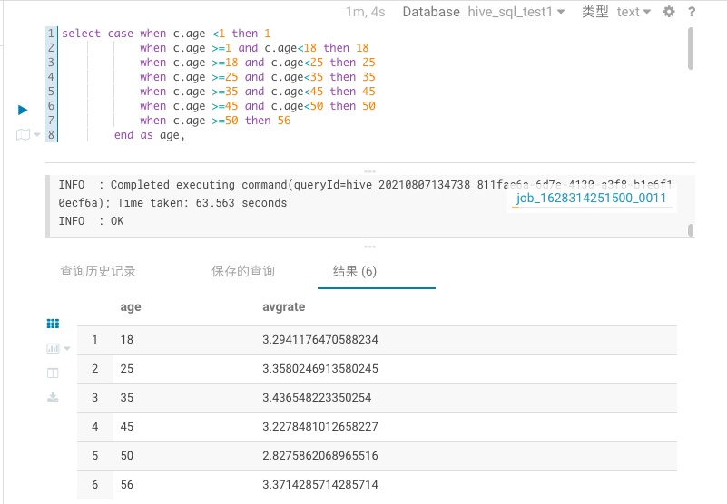
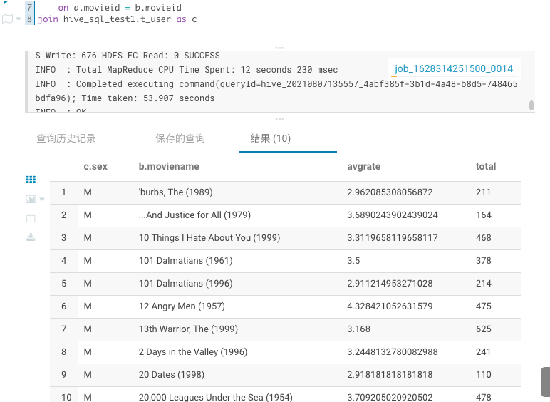
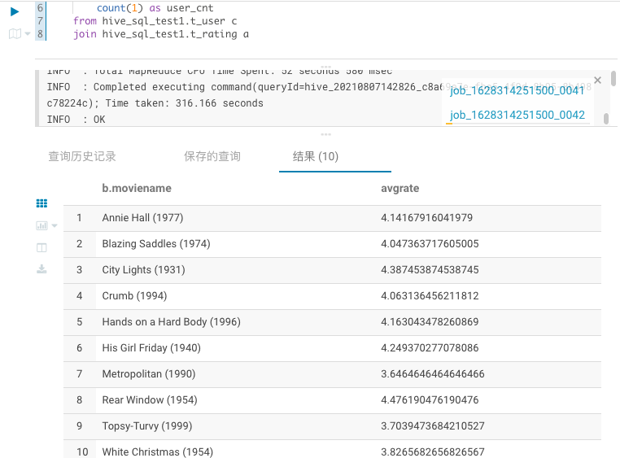

### Hive 作业实践

#### 题目一
展示电影ID为2116这部电影各年龄段的平均影评分
```sql
use hive_sql_test1;
select case when c.age <=1 then 1 
			when c.age >=1 and c.age<18 then 18
			when c.age >=18 and c.age<25 then 25
			when c.age >=25 and c.age<35 then 35
			when c.age >=35 and c.age<45 then 45
			when c.age >=45 and c.age<50 then 50
			when c.age >=50 then 56
		end as age,
		avg(a.rate) as avgrate
from hive_sql_test1.t_rating as a
join hive_sql_test1.t_user as c 
 	on a.userid=c.userid
where a.movieid = 2116
group by case when c.age <=1 then 1 
			when c.age >=1 and c.age<18 then 18
			when c.age >=18 and c.age<25 then 25
			when c.age >=25 and c.age<35 then 35
			when c.age >=35 and c.age<45 then 45
			when c.age >=45 and c.age<50 then 50
			when c.age >=50 then 56
		end
```
sql结果
```sql
age	avgrate	
18	3.2941176470588234	
25	3.3580246913580245	
35	3.436548223350254	
45	3.2278481012658227	
50	2.8275862068965516	
56	3.3714285714285714	
```


#### 题目二
找出男性评分最高且评分次数超过50次的10部电影，展示电影名，平均影评分和评分次数
```sql

use hive_sql_test1;

select c.sex,
		b.moviename,
		avg(a.rate) as avgrate,
		count(1) as total
from hive_sql_test1.t_rating as a
join hive_sql_test1.t_movie as b 
	on a.movieid = b.movieid
join hive_sql_test1.t_user as c 
 	on a.userid=c.userid
where c.sex='M'
group by c.sex,
		 b.moviename
having count(1)>50
limit 10;

```
sql结果
```sql
c.sex	b.moviename	avgrate	total	
M	'burbs, The (1989)	2.962085308056872	211	
M	...And Justice for All (1979)	3.6890243902439024	164	
M	10 Things I Hate About You (1999)	3.3119658119658117	468	
M	101 Dalmatians (1961)	3.5	378	
M	101 Dalmatians (1996)	2.911214953271028	214	
M	12 Angry Men (1957)	4.328421052631579	475	
M	13th Warrior, The (1999)	3.168	625	
M	2 Days in the Valley (1996)	3.2448132780082988	241	
M	20 Dates (1998)	2.918181818181818	110	
M	20,000 Leagues Under the Sea (1954)	3.709205020920502	478	
```


#### 题目三
找出影评次数最多的女士所给出最高分的10部电影的平均影评分，展示电影名和平均影评分
```sql
use hive_sql_test1;

with user_rate_cnt as (
  select a.userid,a.user_cnt,
		row_number() over(order by a.user_cnt desc) as rn
 	from (
	select c.userid,
		count(1) as user_cnt
	from hive_sql_test1.t_user c 
	join hive_sql_test1.t_rating a 
	  on c.userid=a.userid
	where c.sex='F'
	group by c.userid
	) a 
), mov_10 as (
	select a.movieid,
			a.rate,
			row_number() over(order by a.rate desc) as rnk
	from hive_sql_test1.t_rating a 
	join user_rate_cnt t on a.userid=t.userid and t.rn=1
)
select b.moviename,
		avg(a.rate) as avgrate
from hive_sql_test1.t_rating a 
join hive_sql_test1.t_movie b on a.movieid=b.movieid
where a.movieid in (
		select movieid from mov_10 where rnk<=10)
group by b.movename

```
sql结果
```sql
b.moviename	avgrate	
Annie Hall (1977)	4.14167916041979	
Blazing Saddles (1974)	4.047363717605005	
City Lights (1931)	4.387453874538745	
Crumb (1994)	4.063136456211812	
Hands on a Hard Body (1996)	4.163043478260869	
His Girl Friday (1940)	4.249370277078086	
Metropolitan (1990)	3.6464646464646466	
Rear Window (1954)	4.476190476190476	
Topsy-Turvy (1999)	3.7039473684210527	
White Christmas (1954)	3.8265682656826567	
```
