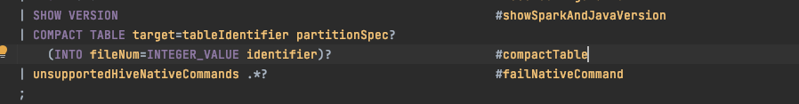
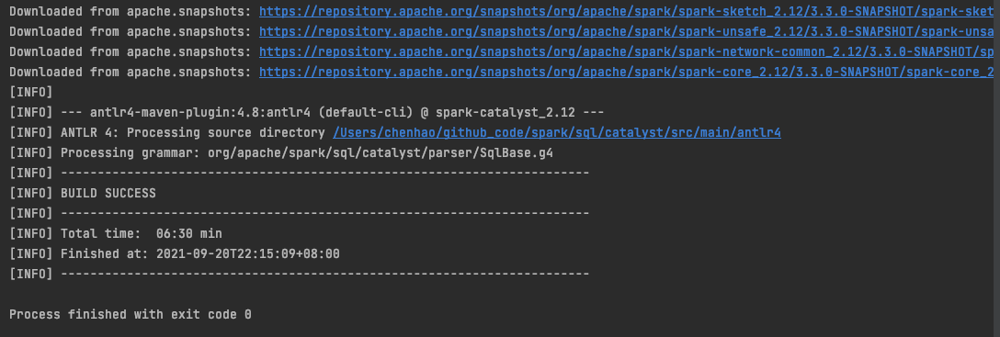

### Spark SQL优化作业
#### 思考题：如何避免小文件问题
**形成小文件的背景可能有：**
Spark SQL在执行ETL（filter/shuffle）后，很难评估待写出的数据量，再加上写出的数据大小会受到压缩算法和存储格式的影响，则有可能生成的数据文件很多，但每个文件都很小，也就是一组碎片化的文件。
文件数量主要是shuffle操作决定：
1. shuffle分区过多过碎，则会导致写入性能差且小文件数量多。
2. shuffle分区过少过大，写入并发度不够，影响任务执行效率。

碎片文件导致后续在读表查询时产生读性能问题，主要可能有：
1. 读操作时，文件listing操作非常耗时（需要寻找读入大量文件），造成磁盘和网络的IO影响；同时也对nameNode的内存造成压力。
2. spark SQL任务执行，会根据文件数量启动大量的map task，单个task虽然执行很快，但对调度系统yarn带来压力，整体耗时反而增大。
3. hdfs的存储时面临超出文件个数上限的潜在风险，这主要是底层操作系统Linux/Unix的文件系统决定的。

**解决思路主要有以下几个方面：**
1. SQL层面解决
	1. 设置参数调节并行度
		通过set spark.sql.shuffle.partitions参数，比如从200调整至100来降低并行度，导致最终生成的文件数量减少。但坏处是执行耗时会增加，减少小文件的效果有，但不理想。
	2. 增加一个并行度=1的job，专门合并小文件。
		先将数据写入一个临时分区，再通过set spark.sql.shuffle.partitions=1，和类似如下SQL语句落盘最终数据文件
		```sql
		insert overwrite table targetTable 
		select * from sourceTable group by *
		```
		group by在spark中属于宽依赖，所以会进行shuffle操作，如此将原先的多个小文件通过shuffle后合并成少量的大文件。
	3. 与2类似，通过SQL语句在写表操作时合并小文件
		在查询任务完成后，通过distribute by rand()来触发shuffle操作重新分区。rand()函数会将数据随机分发，如此重新分区后，每个分区大小基本相等，文件大小也会尽量靠近block size的大小。
		```sql
		select * from table distribute by rand()
		```
2. 实现一个自定义SQL语法进行文件合并的操作
	主要功能：
	1. 能够指定表或分区的文件合并
	2. 对于分区表：如果指定分区则合并分区；如果没有指定分区，则递归所有分区进行合并
	3. 如果指定生成的文件数量，直接按文件数量合并

#### 实现Compact table command
1. 在SqlBase.g4中添加自定义命令compact table。

2. 通过maven重新编译antlr4。
	
3. 在SparkSqlParser.scala中添加对应的visit方法visitCompactTable。
	```scala
	  // visitCompactTable
	  override def visitCompactTable(ctx: CompactTableContext): LogicalPlan = withOrigin(ctx) {
	    // 获取目标表名
	    // 获取指定分区
	    // 获取指定的文件数，若该参数为空调用operationNotAllowed方法给出告警信息
	    val targetTable = visitTableIdentifier(ctx.target)
	    val partSpecs = Option(ctx.partitionSpec).map { specCtx =>
	      UnresolvedPartitionSpec(visitNonOptionalPartitionSpec(specCtx), None)
	    }
	    val fileNum = ctx.INTEGER_VALUE.getText.toInt
	    if (fileNum.isEmpty) {
	      operationNotAllowed("COMPACT TABLE must be specify a int number for files", ctx)
	    }
	    CompactTableCommand(
	      targetTable,
	      partSpecs.toSeq,
	      fileNum)
	  }
	```
4. 在org/apache/spark/sql/execution/command/下添加CompactTableCommand.scala文件，实现CompactTableCommand方法。
	1. getTableLocation函数：获取表底层文件的存储路径
	2. moveFiles函数：用于移动指定目录下的文件
	3. mergeFiles函数：用于通过coalesce函数实现小文件合并，同时通过两次调用moveFiles函数实现移动源文件到合并目录，和将合并后的新文件移动回源文件目录。
	4. 具体代码如下
```scala
package org.apache.spark.sql.execution.command

import java.net.URI
import java.util.Date

import org.apache.hadoop.fs.{FileSystem, Path}
import org.apache.log4j.Logger

import org.apache.spark.{SparkConf, SparkContext}
import org.apache.spark.sql.{Row, SaveMode, SparkSession, SQLContext}
import org.apache.spark.sql.catalyst.TableIdentifier
import org.apache.spark.sql.catalyst.catalog.{CatalogTable, CatalogTableType, InMemoryCatalog, SessionCatalog}
import org.apache.spark.sql.catalyst.parser.ParserInterface
import org.apache.spark.sql.internal.{SessionState, SharedState}


case class CompactTableCommand(
    targetTable: TableIdentifier,
    partSpecs: partitionSpec,
    fileNum: Int) extends LeafRunnableCommand {

    val sparkConf = new SparkConf().setMaster("local[*]").setAppName("mergeFile")
    val sc = new SparkContext(sparkConf)
    val sqlContext = new HiveContext(sc)
    val fileSystem = FileSystem.get(sc.hadoopConfiguration)
    val logger = Logger.getLogger("org")

  override def run(sparkSession: SparkSession): Seq[Row] = {
    /*
    * * 合并步骤：
    * 1. 将小文件目录(srcDataPath)下的文件移动到临时目录/mergePath/${mergeTime}/src
    * 2. 使用coalesce或者repartition， 传入分区数(默认500)。 将数据写入临时的数据目录(/mergePath/${mergeTime}/data)
    * 3. 将临时数据目录文件move到文件目录(srcDataPath)
    * 4. 删除临时目录(mergePath)
    * */
    val srcDataPath = getTableLocation(targetTable.toString, sparkSession)
    val mergePath = "/Users/chenhao/github_code/spark/data/mergeTmp"
    val mergeTime = new Date().getTime.toString
    val partitionSize = fileNum
    val result = mergeFiles(sqlContext, fileSystem,
        mergeTime, srcDataPath, mergePath, partitionSize)
    Seq(Row(logger.info("result: " + result)))
  }

  def mergeFiles(sqlContext: SQLContext, fileSystem: FileSystem, mergeTime: String,
                 srcDataPath: String, mergePath: String, partitionSize: Int): String = {
    val mergeSrcPath = mergePath + "/" + mergeTime + "/src"
    val mergeDataPath = mergePath + "/" + mergeTime + "/data"
    var mergeInfo = "merge success"

    try {
      /*
      * 1.将需要合并的文件mv到临时目录
      * 2.将合并目录的src子目录下的文件合并后保存到合并目录mergeDataPath的data子目录下
      * 3.利用coalesce函数对数据文件重新分区（repartition函数应该也可以做到），即合并，并将文件保存至mergeDataPath目录下。
      * 3.将mergeDataPath的data目录下的文件移动到原目录
      * 4.删除合并目录src的子目录
      * */
      moveFiles(fileSystem, mergeTime, srcDataPath, mergeSrcPath, true)
      val srcDF = sqlContext.read.format("parquet").load(mergeSrcPath + "/")
      srcDF.coalesce(partitionSize).write.format("parquet")
        .mode(SaveMode.Overwrite).save(mergeDataPath)
      moveFiles(fileSystem, mergeTime, mergeDataPath, srcDataPath, false)
      fileSystem.delete(new Path(mergePath + "/" + mergeTime), true)

    } catch {
      case e: Exception => e.printStackTrace()
        mergeInfo = "merge failed"
    }
    mergeInfo
  }

  def moveFiles(fileSystem: FileSystem, mergeTime: String, fromDir: String,
                destDir: String, ifTruncDestDir: Boolean): Unit = {
    /*
    * 1.判断目标目录是否存在，不存在即建立
    * 2.是否清空目标目录下面的所有文件
    * 3.将srcDataPath目录下的除"_SUCCESS"外的文件逐个移动到mergeSrcPath目录下
    * */

    val fromDirPath = new Path(fromDir)
    val destDirPath = new Path(destDir)

    if (!fileSystem.exists(new Path(destDir))) {
      fileSystem.mkdirs(destDirPath.getParent)
    }

    if (ifTruncDestDir) {
      fileSystem.globStatus(new Path(destDir + "/*") )
        .foreach(x => fileSystem.delete(x.getPath(), true))
    }

    var num = 0
    fileSystem.globStatus(new Path(fromDir + "/*")).foreach(x => {
      val fromLocation = x.getPath().toString
      val fileName = fromLocation.substring(fromLocation.lastIndexOf("/") + 1)
      val fromPath = new Path(fromLocation)

      if (fileName != "_SUCCESS") {
        var destLocation = fromLocation.replace(fromDir, destDir)
        val fileSuffix = if (fileName.contains("."))
          {fileName.substring(fileName.lastIndexOf("."))}
          else {""}
        val newFileName = mergeTime + "_" + num + fileSuffix
        destLocation = destLocation.substring(0, destLocation.lastIndexOf("/") + 1) + newFileName
        num = num + 1

        val destPath = new Path(destLocation)

        if (!fileSystem.exists(destPath.getParent)) {
          fileSystem.mkdirs(destPath.getParent)
        }
        fileSystem.rename(fromPath, destPath) // hdfs dfs -mv
      }
    })
  }

  def getTableLocation(table: String, sparkSession: SparkSession): String = {
      val sessionState: SessionState = sparkSession.sessionState
      val sharedState: SharedState = sparkSession.sharedState
      val catalog: SessionCatalog = sessionState.catalog
      val sqlParser: ParserInterface = sessionState.sqlParser
      val client = sharedState.externalCatalog match {
        case catalog: HiveExternalCatalog => catalog.client
        case _: InMemoryCatalog => throw new IllegalArgumentException("In Memory catalog doesn't " +
          "support hive client API")
      }
      val idtfr = sqlParser.parseTableIdentifier(table)
      require(catalog.tableExists(idtfr), new IllegalArgumentException(idtfr + " done not exists"))
      val rawTable = client.getTable(idtfr.database.getOrElse("default"), idtfr.table)
      rawTable.location.toString
  }
}
```
5. 编译暂未通过，调试中……
